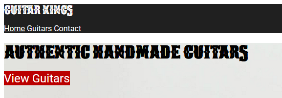

# HTML and CSS Module 2

## Task 3

In this lesson task you format the navigation.

### Brief

By the end of this lesson task:
- The navigation elements should all be on one line with no bulletpoints showing
- The underlines on the links should be removed.
- An active class should be added to the navigation item that the user is on to remind them which page they're on.

You do not need to implement a hamburger menu at this point. We'll look at that when we cover media queries.

By the end of this task, your site should look like this

